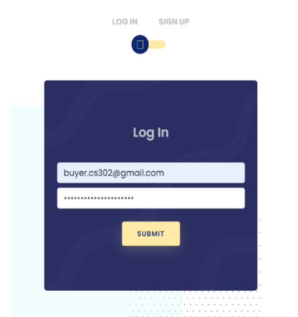

**Prerequisites:**

You should have the following programs installed on your computer:

- Docker
- MAMP Server / WAMP Server
- Postman

**Setting up the initial database**

1. Use MAMP / WAMP myphpadmin to create a new user and enable global privileges. Username is 302, password is also 302.
2. For each service, please create a database schema using the service&#39;s name for each database respectively.
3. Run the SQL files in each service to reset the database appropriately.
4. Note for accounts

Please use Postman to create the accounts required for testing:

| POST http://localhost/33000/accounts/login |
| --- |
| {&quot;user\_email&quot;: &quot;[haniel@danley.com](mailto:haniel@danley.com)&quot;,&quot;password&quot;: &quot;TA&quot;,&quot;user\_phone&quot;: &quot;22222222&quot;} |
| {&quot;user\_email&quot;: &quot;phris@coskitt.com&quot;,&quot;password&quot;: &quot;coffeewaktu&quot;,&quot;user\_phone&quot;: &quot;99999999&quot;} |
| {&quot;user\_email&quot;: &quot;cposkitt@smu.edu.sg&quot;,&quot;password&quot;: &quot;kopitime&quot;,&quot;user\_phone&quot;: &quot;88888888&quot;} |

We did not include this in the sql file as the password is encrypted using the Flask&#39;s werkzeug security libraries, not through MySQL.

5. To properly experience our notifications service, please sign up using a legitimate email as iFreelance will send order notifications through the email registered. Due to limitations for AWS SES Sandbox, we can only send email to [buyer.cs302@gmail.com](mailto:buyer.cs302@gmail.com), [seller.cs302@gmail.com](mailto:seller.cs302@gmail.com), and any email under the ifreelance.site domain. Furthermore, we are limited to 200 emails per 24-hour period and 1 email per second.

The following email IDs are provided for convenience in testing:

| **Email** | **Google Password** | **iFreelance.site Password** |
| --- | --- | --- |
| seller.cs302@gmail.com | seller\_ifreelancecs302 | seller.cs302@gmail.com |
| buyer.cs302@gmail.com | buyer\_ifreelancecs302 | buyer.cs302@gmail.com |

**Running the application locally using Docker**

- Navigate to cs302-t3-leslielamport/dev.env and fill up the necessary environment variables.
- On your terminal, run the following commands:

| cd cs302-t3-leslielamport |
| --- |
 docker compose up -d --build |

- It will run the docker containers for you. After it is done, you are able to access the APIs using Postman, or directly interact with our UI.

**Additional Steps for Payment**

- Navigate tocs302-t3-leslielamport/services/stripe/src/main/resources/static/index.js
- On lines 11-13, comment out the production URLs.
- On lines 16-18, uncomment the development URLs.
- The image below shows what the code should look like in dev mode.

- This will be recompiled in the next step.

**Setting up a local Stripe webhook endpoint (use existing account)**

- Log in to Stripe with the following credentials: (please ask owner for credentials)
- Stripe CLI is required and can be installed with brew install stripe/stripe-cli/stripe
- In terminal, enter stripe login
- Follow the steps to configure Stripe CLI with the registered account.
- Enter stripe listen --forward-to localhost:8080/webhook
- Navigate to cs302-t3-leslielamport/services/stripe and recompile with mvn -Dspring.profiles.active=dev clean package
- Navigate to cs302-t3-leslielamport/services/payment and recompile with mvn -Dspring.profiles.active=dev clean package

**Setting up a local Stripe webhook endpoint (create new account)**

- Create and verify a Stripe account. We will need to set up and use the Stripe CLI to test a webhook locally, as registering a local webhook endpoint with Stripe is not supported.
- Navigate to [https://dashboard.stripe.com/test/apikeys](https://dashboard.stripe.com/test/apikeys) and obtain the publishable test and secret test keys.
- Stripe CLI is required and can be installed with brew install stripe/stripe-cli/stripe
- In terminal, enter stripe login
- Follow the steps to configure Stripe CLI with the registered account.
- Enter stripe listen --forward-to localhost:8080/webhook
- The following link can be used as a reference for the setup: [https://dashboard.stripe.com/test/webhooks/create?endpoint\_location=local](https://dashboard.stripe.com/test/webhooks/create?endpoint_location=local)
- Obtain the webhook signing secret that is displayed in terminal
- Navigate to cs302-t3-leslielamport/services/stripe/src/main/resources/application-dev.yml
- Change STRIPE\_PUBLISHABLE\_KEY, STRIPE\_SECRET\_KEY, STRIPE\_WEBHOOK\_SECRETfrom the existing to the ones obtained from dashboard and terminal.
- Navigate to cs302-t3-leslielamport/services/stripe/.env
- Again, change STRIPE\_PUBLISHABLE\_KEY, STRIPE\_SECRET\_KEY, STRIPE\_WEBHOOK\_SECRETfrom the existing to the ones obtained from dashboard and terminal.
- Navigate to cs302-t3-leslielamport/services/stripe and recompile with mvn -Dspring.profiles.active=dev clean package
- Navigate to cs302-t3-leslielamport/services/payment and recompile with mvn -Dspring.profiles.active=dev clean package
- Both Payment and Stripe will use the dev profile now.

The user interface should be running and able to be open by accessing [http://localhost:3002](http://localhost:3002/) in your preferred browser.

By accessing the link [http://localhost:3002/login\_signup](http://localhost:3002/login_signup) you should be able to see the login page:

Proceed to login or sign up, and upon successful login you should be able to see our homepage:

Or directly access the homepage link [http://localhost:30002/homepage](http://localhost:30002/homepage) to login

Feel free to explore iFreelance by following our demo video and key use cases.

**Errors**

In case of errors:

- For 500 Error, make sure that your WAMP/MAMP is running with appropriate databases set. Make sure your Docker is also running.
- For 400 errors, if you are using Postman, please follow our API documentation syntax. If using UI, please make sure you input all fields.
- For other 403/404 errors, please make sure the data you inputted is correct (e.g., login credentials).
